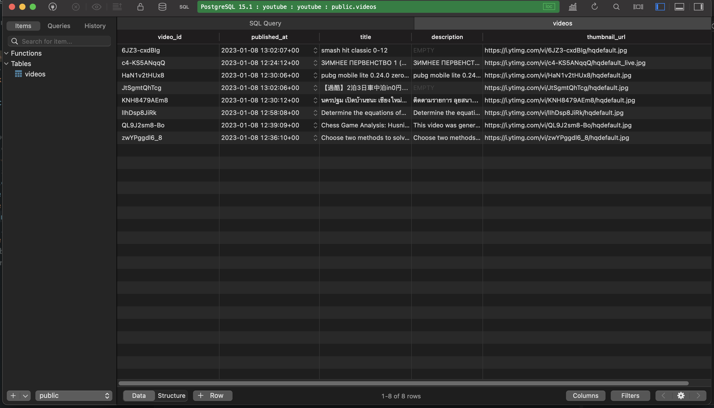

# Youtube Latest videos Search Engine

## Setup - Detailed Instructions Below

1. Git clone the repo ```git clone [url]```
2. RUN ```cd fampay-assignment```
3. RUN ```npm install```
4. Modify .env file
   ```
   POSTGRES_USER=admin
   POSTGRES_PASSWORD=password123
   POSTGRES_DATABASE=youtube
   YOUTUBE_API_KEY=
   YOUTUBE_API_KEY_FALLBACK=
   POSTGRES_HOST=127.0.0.1
   POSTGRES_PORT=5432
   PORT=500
   ```
5. In the Above .env file, make sure to add YOUTUBE_API_KEY and YOUTUBE_API_KEY_FALLBACK
6. RUN ```export $(cat .env)```
7. RUN ```docker-compose up```
7. RUN ```npm run start```

## Configuring Youtube API

It's mentioned [here](https://developers.google.com/youtube/v3/getting-started), on how to get API key by enabling youtube data API in your google cloud console.
- Line number 5 at process/index.js contains the keywords that you configure.

## Search API Docs
- I have an attached the postman collection ```docs/youtube.postman_collection.json```, you can import this file
  directly to run the API
- ```
   curl --location --request GET 'http://localhost:5000/search?page=1&perPage=3&query=pubg'
  ```
- API supports three optional query params
  -  page - The page to fetch results from
  -  perPage - The number of results per Page
  -  query - This matches with title or description of video

## Indexing Videos
- There is a cron job that runs every 20 seconds to index videos and it saves them in the postgresql instance.


